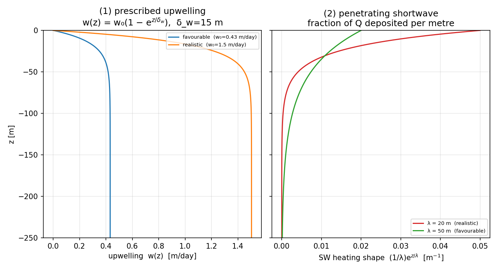
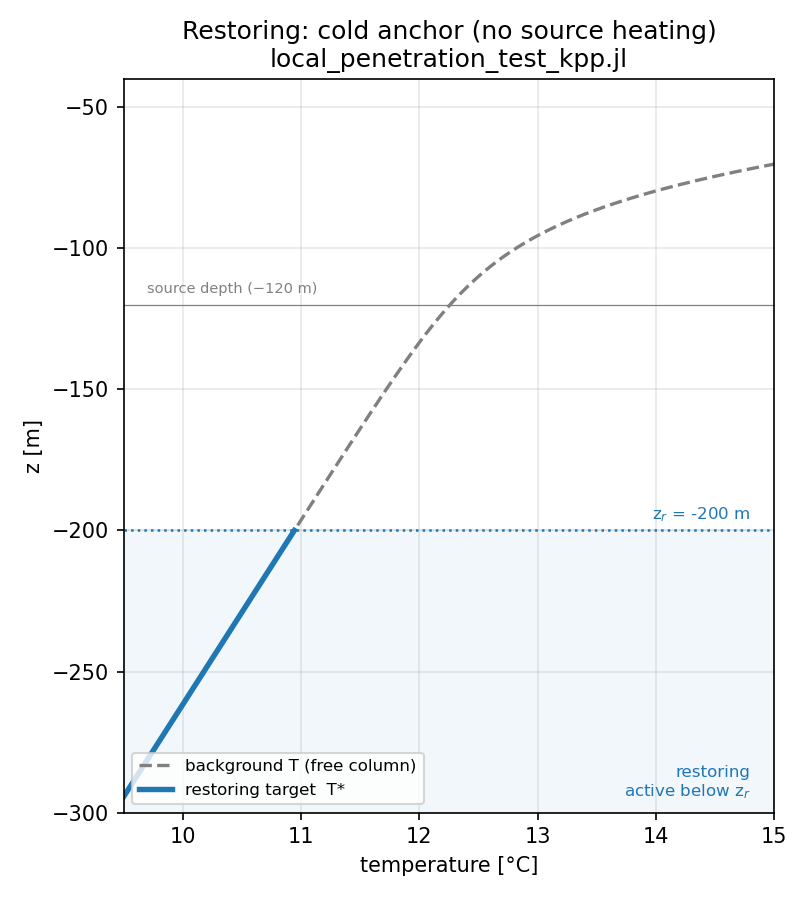
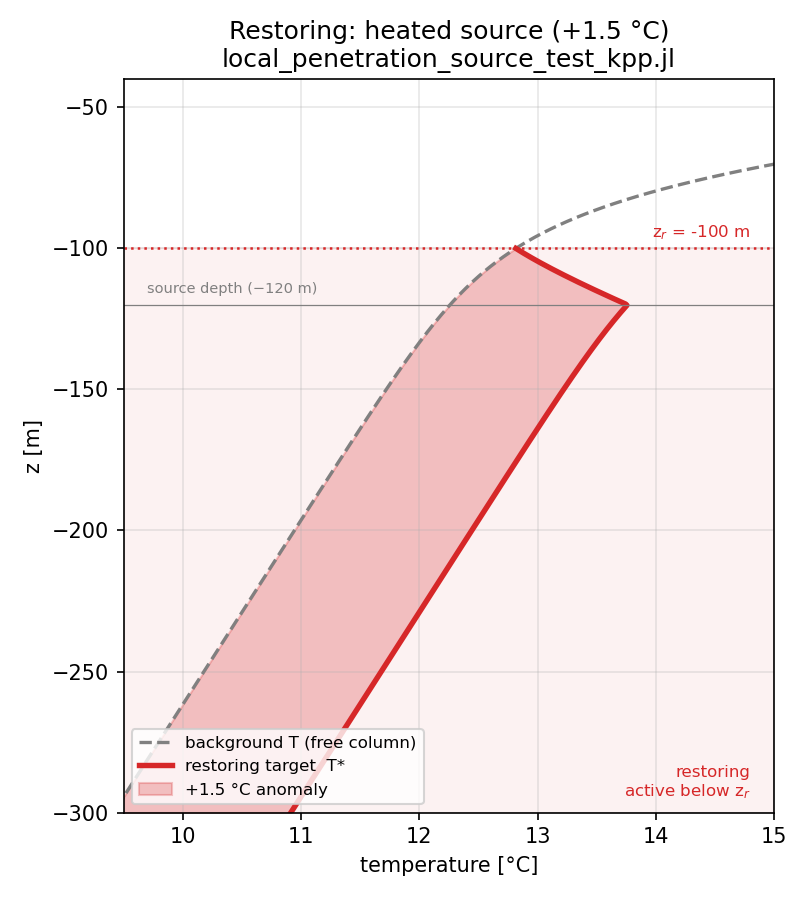

# The KPP single-column model (`local_penetration_test_kpp.jl`, `local_penetration_source_test_kpp.jl`)

A 1-D (single-column) ocean model built on [OceanTurb.jl](https://github.com/glwagner/OceanTurb.jl)'s
**KPP** mixing scheme, used to test whether the eastern-Pacific *destabilization* and *warmer upwelled
water* can be produced by **local** (vertical) processes, or whether the warm upwelled water must be
supplied **remotely**. It is the same experiment as the Pacanowski–Philander version
(`local_penetration_test_pp.jl`) with the mixing scheme swapped for KPP — the scheme ACCESS-OM2 uses.

---

## 1. Model components

The column carries four prognostic fields $U, V, T, S$ on a uniform grid ($N=128$ levels, $H=300$ m,
$\Delta z \approx 2.34$ m). Salinity is held constant; at the equator $f=0$, so the horizontal momentum
equations are pure wind-forced vertical mixing. 

$$\frac{\partial T}{\partial t} = \underbrace{\frac{\partial}{\partial z}\!\left(K_T\,\frac{\partial T}{\partial z}\right) - \frac{\partial \overline{(w'T')}_\text{NL}}{\partial z}}_{\text{(1) KPP mixing (+ nonlocal)}} \;-\; \underbrace{w(z)\,\frac{\partial T}{\partial z}}_{\text{(2) upwelling}} \;+\; \underbrace{\frac{Q_\text{sw}}{\rho_0 c_p}\,\frac{e^{z/\lambda}}{\lambda}}_{\text{(3) penetrating shortwave}} \;+\; \underbrace{\frac{T^\star(z)-T}{\tau}\,\big[z\le z_\text{r}\big]}_{\text{(4) deep restoring / source}}$$

with the surface temperature flux (the **air–sea feedback**) as the top boundary condition on $T$:

$$Q_\theta = \frac{\lambda_\text{fb}}{\rho_0 c_p}\,\big(T_\text{sfc}-T_0\big)\qquad(\text{positive up: the ocean loses heat as it warms}),$$

and a wind-stress flux $Q^u = \tau/\rho_0$ as the top boundary condition on $U$.

| component | symbol | role |
|-----------|--------|------|
| (1) KPP mixing | $K_T, K_U$ + nonlocal flux | parameterized turbulence (boundary layer + interior) |
| (2) upwelling | $w(z)$ | equatorial upwelling (prescribed) |
| (3) shortwave | $Q_\text{sw}, \lambda$ | penetrating solar heating |
| (4) restoring | $T^\star, \tau, z_\text{r}$ | deep reservoir / supplied source water |
| surface BC | $Q_\theta, Q^u$ | air–sea heat feedback, wind stress |

Terms (2)–(4) are supplied to KPP through OceanTurb's native `Forcing` interface (as tendencies), and
$Q_\theta$ is a *function-of-model* flux boundary condition so that the air–sea feedback actually
drives the KPP boundary layer (see §3.1).

---

## 2. Vertical structure of the forcing

The prescribed forcing shapes as a function of depth (all generated by `make_kpp_profiles.py`).

**Upwelling and penetrating shortwave:**

- **(1) Upwelling** `w(z)` is zero at the surface (equatorial divergence) and rises to $w_0$ below
  $\sim\!50$ m; the two curves are the favourable ($0.43$ m/day) and realistic ($1.5$ m/day) regimes.
- **(2) Penetrating shortwave** is a Beer's-law profile — the fraction of $Q_\text{sw}$ deposited per
  metre is $\tfrac1\lambda e^{z/\lambda}$, concentrated near the surface for $\lambda=20$ m (realistic)
  and reaching deeper for $\lambda=50$ m (favourable). It integrates to $Q_\text{sw}$ over the column.

**The restoring deep ocean** — the temperature the water below $z_\text{r}$ is relaxed toward, shown
against the free-column background profile, for the two cases:

| no source heating (penetration script) | heated source (source script) |
|:---:|:---:|
|  |  |

- **Cold anchor** (`local_penetration_test_kpp.jl`): below $z_\text{r}=-200$ m the target $T^\star$
  *equals* the background profile — the deep ocean is simply held at its initial (cold) temperature,
  with no warm anomaly. The source depth ($-120$ m) sits **above** the restoring region, so it is free
  to respond to local shortwave/mixing.
- **Heated source** (`local_penetration_source_test_kpp.jl`): below $z_\text{r}=-100$ m the target is
  $+1.5$ °C warmer than the background (ramped in over $-100$ to $-120$ m), so the upwelled source
  water is **supplied warm** — the *remote* route. The shaded gap is the imposed anomaly.

---

## 3. Parameterisations

### 3.1 KPP vertical mixing (Large, McWilliams & Doney 1994)

KPP splits the column into a surface **boundary layer** of depth $h$ and the **interior** below it.

**Boundary-layer depth $h$** is diagnosed as the shallowest depth at which a *bulk* Richardson number
reaches a critical value $C_\text{Ri}$ — it deepens under destabilizing surface buoyancy flux (cooling)
and shoals under stabilizing flux (warming). This is why the air–sea feedback matters: $Q_\theta$ sets
the surface buoyancy flux $Q_b = g(\alpha Q_\theta - \beta Q_s)$ that controls $h$.

**Within the boundary layer** ($-h \le z \le 0$) the diffusivity is a depth-shaped profile

$$K_\phi(z) = h\,\mathcal{W}_\phi(z)\,G(\sigma),\qquad \sigma = -z/h,\qquad G(\sigma)=\sigma(1-\sigma)^2,$$

where $\mathcal{W}_\phi$ is a turbulent velocity scale built from the friction velocity $u_\star$ (wind
stress) and the surface buoyancy flux. For tracers under **unstable** forcing KPP also adds a
**nonlocal (countergradient) flux** — the $\partial_z\overline{(w'T')}_\text{NL}$ term — which
transports heat down the boundary layer independent of the local gradient.

**In the interior** the diffusivity is the sum of a **Richardson-number shear-instability** term
(active mainly in the equatorial undercurrent shear), **internal-wave** background, and **double
diffusion**, plus a small constant background $K_{U0}, K_{T0}$.

KPP **removes static instability internally** (large $K$ wherever $N^2<0$), so — unlike the PP version
— no explicit convective adjustment is needed.

| KPP parameter | code | default | meaning |
|---------------|------|---------|---------|
| surface-layer fraction | `CSL` | 0.1 | fraction of $h$ treated as the surface layer |
| von Kármán constant | `Cτ` | 0.4 | turbulent velocity scaling |
| nonlocal flux constant | `CNL` | 6.33 | strength of countergradient transport |
| critical bulk Richardson no. | `CRi` | 0.3 | sets boundary-layer depth $h$ |
| interior viscosity | `KU₀` | $10^{-6}$ | background momentum diffusivity |
| interior tracer diffusivity | `KT₀` | $10^{-7}$ | background heat diffusivity |

### 3.2 Penetrating shortwave

Surface heating enters as a body source with a Beer's-law profile, $\dfrac{Q_\text{sw}}{\rho_0 c_p}\dfrac{e^{z/\lambda}}{\lambda}$
(°C s⁻¹), which integrates to $Q_\text{sw}$ over depth. The e-folding depth $\lambda$ is the one physical
knob for "how deep does surface heat get" — ~20 m is realistic clear-water shortwave; 50 m is a generous
upper bound. Because the profile always decays with depth, shortwave *alone* always warms the surface
most (i.e. stratifies); destabilization requires the surface **sink** (§3.4).

### 3.3 Prescribed upwelling

$$w(z) = w_0\left(1 - e^{z/\delta_w}\right),\qquad \delta_w = 15\ \text{m},$$

advected upwind on $T$ ($-w\,\partial_z T$, upstream = below for $w>0$). It is **zero at the surface**
(representing equatorial horizontal divergence) and asymptotes to the interior rate $w_0$ below the
divergence layer. It is a prescribed kinematic field, not a dynamical response.

### 3.4 Deep restoring / source water

Below $z_\text{r}$ the temperature is relaxed toward a target on a timescale $\tau=60$ d:

$$T^\star(z) = T_\text{profile}(z) + \Delta T_\text{src}\,\min\!\Big(1,\tfrac{z_\text{r}-z}{d_\text{ramp}}\Big),\qquad d_\text{ramp}=20\ \text{m}.$$

This is the 1-D closure for the deep ocean the column cannot simulate: it **supplies the water that
upwelling draws up** and **prevents drift** at depth. It plays two roles:
- $\Delta T_\text{src}=0$, $z_\text{r}=-200$ m → a **cold anchor** (the "no remote warming"
  counterfactual, used in `local_penetration_test_kpp.jl`);
- $\Delta T_\text{src}>0$, $z_\text{r}=-100$ m → it **warms the upwelled source water directly** (the
  *remote* route, used in `local_penetration_source_test_kpp.jl`). The ramp avoids a temperature step
  at $z_\text{r}$.

### 3.5 Air–sea feedback (surface sink)

$Q_\theta = \lambda_\text{fb}(T_\text{sfc}-T_0)/\rho_0 c_p$ is a Newtonian surface heat loss that grows
as SST rises — the eastern-Pacific "ocean thermostat". It caps SST and, crucially, provides a surface
heat **sink** that the penetrating shortwave below the mixed layer does **not** have: this is what lets
the subsurface out-warm the (damped) surface and is the proposed route to *local* destabilization.

---

## 4. Background state & parameters

| group | values |
|-------|--------|
| constants | $f=0$, $\alpha=2\times10^{-4}$, $\beta=8\times10^{-4}$, $\rho_0=1025$, $g=9.81$, $c_p=3991$ |
| grid | $N=128$, $H=300$ m ($\Delta z\approx2.34$ m) |
| thermocline (initial $T$) | $T_\text{profile}(z)=14 + 5\,[1+\tanh\!\frac{z+50}{30}] + \Gamma_\text{bg}\,z$, with $N^2_\text{bg}=3\times10^{-5}$, $\Gamma_\text{bg}=N^2_\text{bg}/(g\alpha)$ |
| shear (initial $U$) | $U_0(z) = -0.25\,e^{z/50} + 0.60\,\exp[-(-z-110)^2/(2\cdot45^2)]$ (SEC over EUC) |
| wind stress | $\tau=0.01$, applied as $Q^u=\tau/\rho_0$ |
| upwelling | $w_0 = 0.43$ (fav.) / $1.5$ (real.) m/day, $\delta_w=15$ m |
| shortwave | $Q_\text{sw}=80$ W m⁻², $\lambda = 50$ (fav.) / $20$ (real.) m |
| feedback | $\lambda_\text{fb}=50$ (fav.) / $30$ (real.) W m⁻² K⁻¹ |
| restoring | $\tau=60$ d, $z_\text{r}=-100$/$-200$ m, $d_\text{ramp}=20$ m, $\Delta T_\text{src}=1.5$ °C |

---

## 5. Numerics

Time stepping is implicit (`:BackwardEuler`), $\Delta t = 15$ min (illustrative runs) or 20–30 min
(sweeps), integrated 2 years. Each step first updates the KPP state (boundary-layer depth and surface
fluxes from the current solution) and then solves the implicit diffusion; the `Forcing` terms (2)–(4)
are applied explicitly within the same step. Because KPP handles static instability internally, no
convective-adjustment step is required.

> Regenerate the forcing-profile figure with `python3 make_kpp_profiles.py` (matplotlib); it reads the
> same analytic forms used by the Julia scripts.
